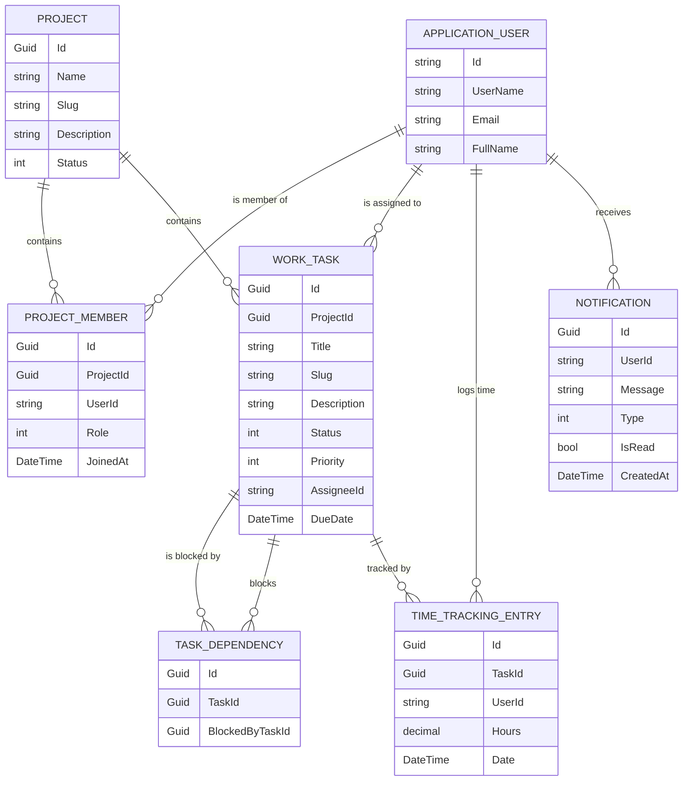

# 📊 Entity Relationship Diagram (ERD)

This document provides a visual representation of the Domain Models and their relationships within the **Task Management API**.

---

## 🏗️ Domain Model Map

---

## 🧩 Relationship Descriptions

### 1. Project & Members
A **Project** has a one-to-many relationship with **ProjectMember**. This acts as a junction between the identity system and our domain modules, allowing us to assign roles (Owner, Manager, Developer) per project.

### 2. Projects & Tasks
A **Project** contains multiple **WorkTask** entities. Tasks are strictly scoped to a single project and cannot exist independently.

### 3. Task Dependencies (Self-Referencing)
A **WorkTask** can have multiple **TaskDependency** entries. This enables complex blocking logic:
- **BlockedBy**: This task waits for another task.
- **Blocking**: This task prevents another task from starting.

### 4. Time Tracking
Users can log time against specific tasks. A **TimeTrackingEntry** connects a **WorkTask** with an **ApplicationUser** via their `UserId`.

### 5. Identity Integration
The **ApplicationUser** entity (extending `IdentityUser`) is the central anchor for all actor-based relationships across the system.
